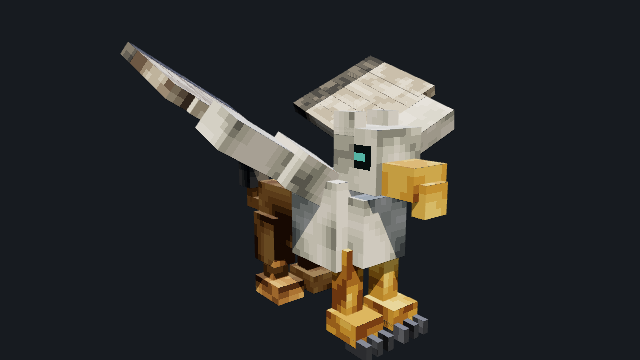

# Ashfox

**Assets as Code. Built for voxel games.**

Ashfox is the open-source Assets as Code toolkit for voxel games.
Define models, textures, and sounds in native `.ashfox` source. Version them
in Git. Build them into assets for your game or Minecraft.

<p align="center">
  <a href="https://ashfox.io/#examples"></a>
  <a href="https://ashfox.io/#collection"></a>
  <a href="https://ashfox.io/#sound"></a>
</p>

[Models](https://ashfox.io/#examples) · [Textures](https://ashfox.io/#collection) · [Listen to sounds](https://ashfox.io/#sound)

## Install

With **Node.js 20+ and npm**, run this in your game or asset folder:

<!-- ashfox:install -->
```sh
npm install --save-dev https://github.com/sigee-min/ashfox/releases/download/v1.0.0/ashfox-cli.tgz
npx --no-install ashfox capabilities
```
<!-- ashfox:install-end -->

No repository clone, source build, account or API key is needed.

## Make your first asset

<!-- ashfox:start -->
Download and extract the [starter assets](https://github.com/sigee-min/ashfox/releases/download/v1.0.0/starter.zip), then run the install
command above inside that folder:

```sh
npx --no-install ashfox export sword.ashfox --output sword.png
```
<!-- ashfox:start-end -->

Your first PNG is ready to import. Edit its `.ashfox` source with your coding
agent, then export to a new filename. The starter also includes a model and sound.

Prefer to look around first? [Explore the interactive examples](https://ashfox.io/)
or [open the Model Workbench](https://ashfox.io/workbench/) in your browser.

[Installation and troubleshooting](docs/guides/install.md) ·
[Create with your coding agent](docs/guides/ai-agent-quick-start.md) ·
[All guides](docs/README.md)

## Your assets. Your repo.

1. **Define** assets in `.ashfox` files with your coding agent.
2. **Inspect** the source and review model views, native pixels and sound.
3. **Review** source changes in Git alongside captures and build evidence.
4. **Build** with a pinned toolchain and deliver verified outputs to your game.

The source is the editable asset. GLB, PNG, audio and ZIP files are compiled
outputs. An optional `.ashfoxworkspace` configures larger projects; a single
asset needs no workspace.

[Adopt Assets as Code](docs/guides/assets-as-code.md) ·
[Automate builds](docs/guides/automation.md) ·
[Work with an agent](docs/guides/agent-workflow.md)

## From a pixel item to a complete creature

Explore the frontier through working examples: Griffin’s articulated wings and
six motions, a red fox, and a goblin raider. Each has native source and an animated
GLB. These demonstrate asset complexity, not a benchmark of arbitrary generation.

<details>
<summary>See the build replays</summary>

<p align="center">
  
  
  
  <br>
  <sub>Build replays reconstructed from the finished models.</sub>
</p>
</details>

[View examples](https://ashfox.io/#examples) ·
[Launch Workbench](https://ashfox.io/workbench/) ·
[Shared source project](examples/shared-creatures/)

| Character | Keep creating | Use in your game |
| --- | --- | --- |
| Griffin guardian · 6 motions | [.ashfox source](examples/griffin/workbench/main.ashfox) | [GLB](assets/exports/griffin/griffin.glb) |
| Red fox · 3 motions | [.ashfox source](examples/fox/creatures/fox.ashfox) | [GLB](assets/exports/fox/fox.glb) |
| Goblin raider · 3 motions | [.ashfox source](examples/goblin/creatures/goblin.ashfox) | [GLB](assets/exports/goblin/goblin.glb) |

| Asset | Source | Output |
| --- | --- | --- |
| Pixel sword | [Native source](examples/items/src/iron_sword.ashfox) | [PNG](assets/readme/sword.png) |
| Amethyst | [Item examples](examples/items/) | [PNG](assets/readme/amethyst.png) |
| Claw strike | [Native source](examples/sounds/src/claw_hit.ashfox) | [WAV](assets/docs/claw.wav) |

## Use assets in your game

Native `.ashfox` sources compile through the CLI. An optional `.ashfoxworkspace`
configures PNG, audio and model exports, engine-neutral `game_assets` bundles,
and Minecraft resource packs. A single project can emit both delivery targets.
Generic bundles contain portable GLB/PNG/WAV or OGG, plus a runtime manifest with
asset IDs, paths, animation clips and import hints.

See the [game-asset example](examples/game-assets/.ashfoxworkspace),
[CLI usage](docs/guides/cli.md), and
[runtime manifest contract](docs/guides/game-assets.md).

## Inspect and automate

Use `ashfox inspect` for asset details, `ashfox capture` for a chosen view, and
`ashfox stdio` for a persistent JSON-lines session with your coding agent.
Exports and captures stream over stdout or save to an explicit `--output` path.

Capture requires Chrome or Chromium. OGG audio requires FFmpeg; ordinary GLB,
PNG and WAV exports need neither. No workspace is required.
[Single-asset and stdio guide](docs/guides/observe.md).

## Contribute

Repository development instructions live in [CONTRIBUTING.md](CONTRIBUTING.md).

[MIT license](LICENSE).
