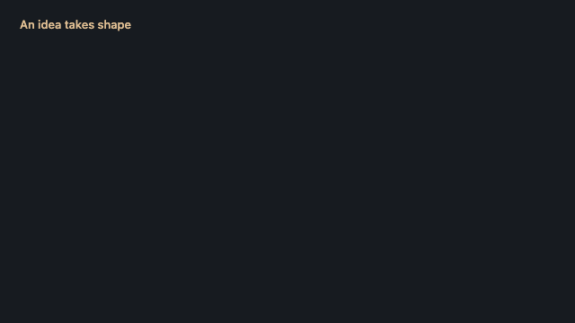
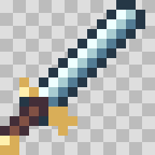
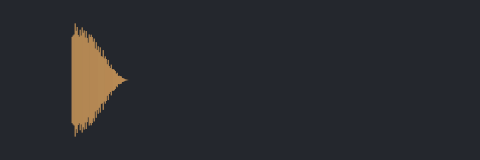
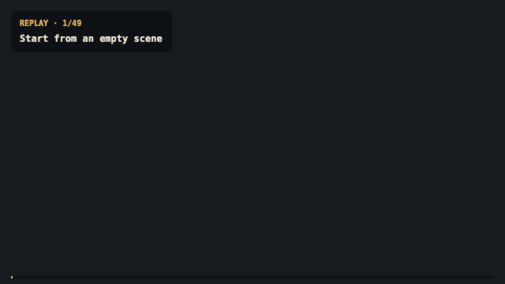

# Ashfox

**Assets as Code. Built for voxel games.**

### Write the source. Build the world.

  
   
  Griffin guardian · 6 motions · Build replay reconstructed from the finished model.

**Models. Textures. Sound. All from code.** Ashfox compiles native `.ashfox`
files into game assets you can version, review and rebuild alongside your game.

[**Explore the live examples →**](https://ashfox.io/) ·
[Read the DSL](docs/language/README.md) ·
[Griffin source](examples/griffin/workbench/main.ashfox)

## Game assets, with a source of truth

A creature's proportions, its pixels, its rig and its motions can live in source
files. So can the sound it makes. Ashfox turns those definitions into assets for
voxel games and Minecraft.

That is **Assets as Code**: the editable asset lives in your repository.
Your coding agent can work on it, your team can review the change, and your build
can produce the deliverables.

## What this makes possible

| The problem | What Ashfox gives you |
| --- | --- |
| Understanding what changed in an asset | Source diffs paired with rendered views, native pixels and sound playback. |
| Keeping related assets consistent | Shared designs, components, surfaces and motions with explicit contracts. |
| Rebuilding the assets for a game revision | Versioned sources and a pinned compiler, with deterministic builds and verifiable outputs. |
| Taking assets from creation into a game | Portable GLB, PNG and audio, game bundles and Minecraft resource packs from the same source project. |

Resize a creature through shared dimensions. Keep its eyes one pixel wide.
Reuse its rig across motions. Review the result and commit the source alongside
the game that uses it.

## Start with a sword. Build a creature.

Explore complete sources and take the compiled assets into your game.
The creatures share a [reusable source project](examples/shared-creatures/).

  
  

Watch the fox and goblin build replays

  
  
   
  Build replays reconstructed from the finished models.

| Character | Keep creating | Use in your game |
| --- | --- | --- |
| Griffin guardian · 6 motions | [.ashfox source](examples/griffin/workbench/main.ashfox) | [GLB](assets/exports/griffin/griffin.glb) |
| Red fox · 3 motions | [.ashfox source](examples/fox/creatures/fox.ashfox) | [GLB](assets/exports/fox/fox.glb) |
| Goblin raider · 3 motions | [.ashfox source](examples/goblin/creatures/goblin.ashfox) | [GLB](assets/exports/goblin/goblin.glb) |

| Asset | Source | Output |
| --- | --- | --- |
| Pixel sword | [Native source](examples/items/src/iron_sword.ashfox) | [PNG](assets/readme/sword.png) |
| Amethyst | [Item examples](examples/items/) | [PNG](assets/readme/amethyst.png) |
| Claw strike | [Native source](examples/sounds/src/claw_hit.ashfox) | [WAV](assets/docs/claw.wav) |

## Build on it

Ashfox is an open-source toolkit for developers and coding agents building voxel
games, reusable asset libraries and Minecraft content. The compiler checks
structure, types and bindings; captures and playback let you judge the result.

[**Explore the examples →**](https://ashfox.io/) ·
[Documentation](docs/README.md) ·
[Assets as Code workflow](docs/guides/assets-as-code.md) ·
[DSL reference](docs/language/README.md) ·
[Model Workbench](https://ashfox.io/workbench/)

[Contribute](CONTRIBUTING.md) · [MIT license](LICENSE)
