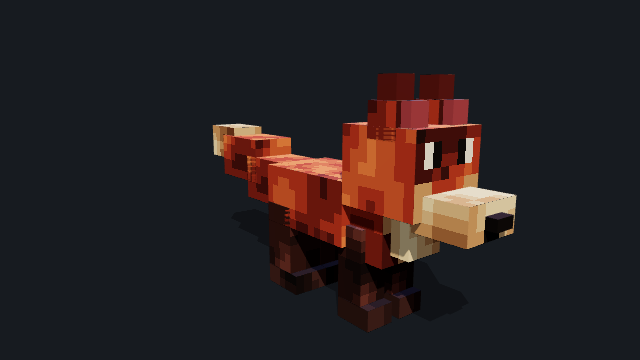
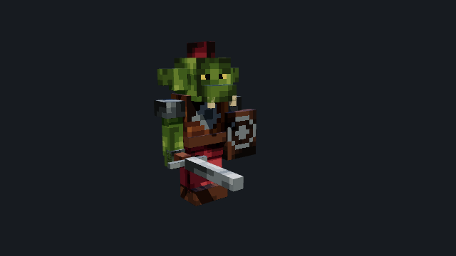

# Ashfox

Write low-poly models, pixel items and procedural sound effects as code.
Compile `.ashfox` sources into assets for voxel games and Minecraft with one CLI.

<p align="center">
  <a href="https://ashfox.io/#examples"></a>
  <a href="https://ashfox.io/#examples"></a>
  <a href="https://ashfox.io/#examples"></a>
</p>

<details>
<summary>See the build replays</summary>

<p align="center">
  
  
  
  <br>
  <sub>Build replays reconstructed from the finished models.</sub>
</p>
</details>

[View examples](https://ashfox.io/#examples) ·
[Launch Workbench](https://ashfox.io/workbench/) ·
[Shared source project](examples/shared-creatures/)

| Character | Keep creating | Use in your game |
| --- | --- | --- |
| Griffin guardian · 6 motions | [.ashfox source](examples/griffin/workbench/main.ashfox) | [GLB](assets/exports/griffin/griffin.glb) |
| Red fox · 3 motions | [.ashfox source](examples/fox/creatures/fox.ashfox) | [GLB](assets/exports/fox/fox.glb) |
| Goblin raider · 3 motions | [.ashfox source](examples/goblin/creatures/goblin.ashfox) | [GLB](assets/exports/goblin/goblin.glb) |

## Get started

Download the [CLI package](https://ashfox.io/downloads/ashfox-cli.tgz) and
[starter assets](https://ashfox.io/downloads/starter.zip). Extract the starter,
put the package in that folder, and run with Node.js 20 or newer:

```sh
npm install --save-dev ./ashfox-cli.tgz
npx --no-install ashfox inspect sword.ashfox
npx --no-install ashfox export sword.ashfox --output sword.png
```

Start with one asset. Add `.ashfoxworkspace` when you need project-wide IDs,
formats and delivery paths. The [web-game sample](docs/guides/web-game.md)
shows models, item images and sound working together.

[Installation](docs/guides/install.md) ·
[First build](docs/guides/ai-agent-quick-start.md) ·
[Documentation](docs/README.md)

The optional [Model Workbench](https://ashfox.io/workbench/) provides browser
model inspection and its own agent API. Its model snapshots are separate from
the native directory project. See [Workbench API](docs/guides/workbench-api.md).

## Build assets from code

Native `.ashfox` sources compile through the CLI. An optional `.ashfoxworkspace`
configures PNG, audio and model exports, engine-neutral `game_assets` bundles,
and Minecraft resource packs. A single project can emit both delivery targets.
Generic bundles contain portable GLB/PNG/WAV or OGG, plus a runtime manifest with
asset IDs, paths, animation clips and import hints.

See the [game-asset example](examples/game-assets/.ashfoxworkspace),
[CLI usage](docs/guides/cli.md), and
[runtime manifest contract](docs/guides/game-assets.md).

## Observe one asset

```sh
npx --no-install ashfox capture fox.ashfox --azimuth 45 --elevation 20 > fox.png
npx --no-install ashfox stdio
```

Receive PNG/GIF, playable audio, exports or inspection JSON over stdout. Capture
uses a headless Chrome/Chromium process and the shared Workbench renderer.
No workspace is required. [Single-asset and stdio guide](docs/guides/observe.md).

## Contribute

Repository development instructions live in [CONTRIBUTING.md](CONTRIBUTING.md).

[MIT license](LICENSE).
