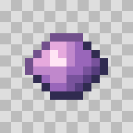

# Ashfox

Write low-poly models, pixel items and procedural sound effects as code.
Compile `.ashfox` sources into assets for voxel games and Minecraft with one CLI.

## Install

With **Node.js 20+ and npm**, run this in your game or asset folder:

```sh
npm install --save-dev https://ashfox.io/downloads/ashfox-cli.tgz
npx --no-install ashfox capabilities
```

No repository clone, source build, account or API key is needed.

## Make your first asset

Download and extract the [starter assets](https://ashfox.io/downloads/starter.zip),
then run the install command above inside that folder. Export an item, a model,
and a sound:

```sh
npx --no-install ashfox export sword.ashfox --output sword.png
npx --no-install ashfox export fox.ashfox --output fox.glb
npx --no-install ashfox export claw_hit.ashfox --output claw-hit.wav
```

Those files are ready to import into your game. Edit the `.ashfox` sources yourself
or with your coding agent, then export again with a new output filename.

Prefer to look around first? [Explore the interactive examples](https://ashfox.io/)
or [open the Model Workbench](https://ashfox.io/workbench/) in your browser.

[Installation and troubleshooting](docs/guides/install.md) ·
[Create with your coding agent](docs/guides/ai-agent-quick-start.md) ·
[All guides](docs/README.md)

## See what you can make

<p align="center">
  <a href="https://ashfox.io/#examples"></a>
  <a href="https://ashfox.io/#examples"></a>
  <a href="https://ashfox.io/#examples"></a>
</p>

<details>
<summary>See the build replays</summary>

<p align="center">
  
  
  
  <br>
  <sub>Build replays reconstructed from the finished models.</sub>
</p>
</details>

[View examples](https://ashfox.io/#examples) ·
[Launch Workbench](https://ashfox.io/workbench/) ·
[Shared source project](examples/shared-creatures/)

| Character | Keep creating | Use in your game |
| --- | --- | --- |
| Griffin guardian · 6 motions | [.ashfox source](examples/griffin/workbench/main.ashfox) | [GLB](assets/exports/griffin/griffin.glb) |
| Red fox · 3 motions | [.ashfox source](examples/fox/creatures/fox.ashfox) | [GLB](assets/exports/fox/fox.glb) |
| Goblin raider · 3 motions | [.ashfox source](examples/goblin/creatures/goblin.ashfox) | [GLB](assets/exports/goblin/goblin.glb) |

### Pixel textures and items

<p align="center">
  <a href="assets/readme/sword.png"></a>
  <a href="assets/readme/amethyst.png"></a>
</p>

[Sword PNG](assets/readme/sword.png) · [Amethyst PNG](assets/readme/amethyst.png) ·
[Edit its source](examples/items/src/iron_sword.ashfox) ·
[Explore more items](https://ashfox.io/#collection)

### Sound effects

[](https://ashfox.io/#sound)

[Listen to the sound](https://ashfox.io/#sound) ·
[Download WAV](assets/docs/claw.wav) ·
[Edit its source](examples/sounds/src/claw_hit.ashfox)

## Use assets in your game

Native `.ashfox` sources compile through the CLI. An optional `.ashfoxworkspace`
configures PNG, audio and model exports, engine-neutral `game_assets` bundles,
and Minecraft resource packs. A single project can emit both delivery targets.
Generic bundles contain portable GLB/PNG/WAV or OGG, plus a runtime manifest with
asset IDs, paths, animation clips and import hints.

See the [game-asset example](examples/game-assets/.ashfoxworkspace),
[CLI usage](docs/guides/cli.md), and
[runtime manifest contract](docs/guides/game-assets.md).

## Observe one asset

```sh
npx --no-install ashfox capture fox.ashfox --azimuth 45 --elevation 20 > fox.png
npx --no-install ashfox stdio
```

Receive PNG/GIF, playable audio, exports or inspection JSON over stdout. Capture
requires Chrome or Chromium. OGG audio requires FFmpeg; ordinary GLB, PNG and WAV
exports need neither.
No workspace is required. [Single-asset and stdio guide](docs/guides/observe.md).

## Contribute

Repository development instructions live in [CONTRIBUTING.md](CONTRIBUTING.md).

[MIT license](LICENSE).
